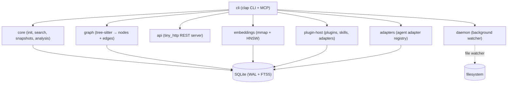

<p align="center">
  <picture>
    <source media="(prefers-color-scheme: dark)" srcset="assets/logo.jpeg">
    
  </picture>
</p>

<h1 align="center">MemoryCore</h1>

<p align="center">
  <b>Local-first coding memory system</b><br/>
  24/7 daemon · Code graph · MCP tools · SQLite vector store<br/>
  <i>One project at a time. All local. No cloud.</i>
</p>

<p align="center">
  
  
  
  
  
  
</p>

<br/>

MemoryCore is a persistent, local-first memory layer for coding projects. It indexes your
source code into a queryable code graph, watches for changes 24/7, and exposes everything
through a CLI, HTTP API, and MCP server — so AI agents and developers share the same
structural understanding of the codebase.

---

## Usage

### 1. Install

```bash
git clone git@github.com:<you>/memorycore.git
cd memorycore
cargo build --release
cp target/release/memorycore ~/.local/bin/
```

Requires **Rust 1.96+**.

---

### 2. Initialize in any project

```bash
cd /path/to/your-project
memorycore init
```

This creates `.memorycore/` — a self-contained directory with everything:

```
your-project/
├── .memorycore/
│   ├── index.db          ← SQLite (WAL + FTS5) — graph nodes, edges, search index
│   ├── config.toml       ← api_addr, dashboard_addr
│   ├── sessions/         ← JSONL.zst archives per agent
│   ├── snapshots/        ← SHA256-addressed snapshots
│   ├── embeddings/       ← binary mmap + HNSW vector store
│   ├── plugins/          ← plugin manifests
│   ├── skills/           ← skill directories
│   ├── events/           ← event records
│   └── logs/             ← daemon logs
└── (your source)
```

Everything stays local. No cloud, no sync, no telemetry. Backup by copying `.memorycore/`.

---

### 3. Start the daemon (24/7 watcher)

```bash
memorycore daemon start
memorycore daemon status    # → running pid 1234
```

The daemon keeps your index fresh. Leave it running while you code.

---

### 4. Index your code

```bash
# Index a single file
memorycore graph file src/main.rs

# Index a whole folder recursively
memorycore graph folder src/
memorycore graph folder lib/

# See what you've got
memorycore status
# → Graph nodes: 1285
# → Graph edges: 2988
```

MemoryCore parses Rust (`.rs`) and JavaScript/JSX (`.js`, `.jsx`) with tree-sitter.
It builds:
- **Nodes** representing files, folders, functions, structs, enums, traits, impl blocks, modules, imports, classes
- **Edges** capturing relationships: `defines`, `calls`, `imports`, `extends`, `contains`, `declares_module`

---

### 5. Search

```bash
memorycore search "auth middleware"
memorycore search "login" --kind Function
memorycore search "database" --limit 20
```

Searches across files, symbols, events, snapshots, and memory cases in one go.

---

### 6. Analyze anything

Point at any file, folder, function, or symbol. MemoryCore resolves it and returns a combined report.

```bash
# Analyze a file — shows graph context + search hits + memory cases
memorycore analyze src/auth.rs
```

Example output:
```
# MemoryCore Analysis: src/auth.rs

Resolved node: file:src/auth.rs [File] src/auth.rs

Graph context: 10 nodes, 12 edges
- file:src/auth.rs -defines-> symbol:src/auth.rs#login
- symbol:src/auth.rs#login -calls-> symbol:src/db.rs#connect
- folder:src/ -contains-> file:src/auth.rs

Search hits:
- [Function] login src/auth.rs
- [Struct] User src/auth.rs
- [Enum] Role src/auth.rs
```

Formats: `text` (default), `json`, `mermaid`.

```bash
memorycore analyze src/auth.rs --format json
memorycore analyze src/auth.rs --format mermaid
```

---

### 7. Trace impact before refactoring

```bash
# Who calls this file?
memorycore graph impact src/auth.rs --depth 2

# Subgraph around a symbol
memorycore graph query "login" --depth 2

# Subgraph as Mermaid diagram
memorycore graph query "login" --depth 2 --format mermaid
```

Impact output:
```
impact for file:src/auth.rs:
- folder:src/ -contains-> file:src/auth.rs
- file:src/lib.rs -declares_module-> file:src/auth.rs
- file:src/auth.rs -defines-> symbol:src/auth.rs#login
- file:src/auth.rs -defines-> symbol:src/auth.rs#User
- symbol:src/auth.rs#login -calls-> symbol:src/db.rs#connect
```

---

### 8. Pin memory for AI agents

Create named memory cases so AI agents (via MCP) know which parts of the codebase matter.

```bash
memorycore memory pin "auth-flow" --target src/auth.rs
memorycore memory pin "db-schema" --target src/db/
memorycore memory pin "payment-api" --target src/api/payment.rs

memorycore memory list
# → memory:auth-flow  →  src/auth.rs
# → memory:db-schema  →  src/db/
# → memory:payment-api →  src/api/payment.rs
```

Agents see these through `memorycore_memory_cases` MCP tool.

---

### 9. Snapshot before risky changes

```bash
memorycore snapshots create --message "before-refactor-auth"
# → Snapshot abc123... created with 47 files, 528737 bytes

memorycore snapshots list
memorycore snapshots show <hash>
```

Snapshots are content-addressed (SHA256). You can diff or restore later.

---

### 10. Monitor with events

```bash
memorycore events --limit 10      # show recent activity
memorycore events --follow        # live tail
memorycore daemon logs            # full daemon log
```

Events record every mutation: file scans, graph changes, snapshots, session imports, plugin activity.

---

### 11. Export diagrams

```bash
# Full project graph as Mermaid
memorycore graph export --format mermaid > architecture.md

# Focused subgraph
memorycore graph query "src/api/" --depth 1 --format mermaid

# Machine-readable for tooling
memorycore graph export --format json > graph.json
```

---

### 12. Expose to AI agents via MCP

```bash
memorycore mcp serve
# 11 tools available on stdio:
#   memorycore_search, memorycore_snapshot,
#   memorycore_graph_query, memorycore_graph_render,
#   memorycore_find_impact, memorycore_analyze,
#   memorycore_embedding_search, ...
```

Configure your MCP client to run `memorycore mcp serve` from the project root.
Any MCP-compatible agent (Claude Code, Cursor, etc.) can then query your codebase
natively — the agent calls `memorycore_analyze` or `memorycore_search` and gets
back structured graph context.

```json
// Example — agent calls:
{
  "method": "tools/call",
  "params": {
    "name": "memorycore_analyze",
    "arguments": { "target": "src/auth.rs", "depth": 2 }
  }
}
```

---

### 13. HTTP API

```bash
memorycore api serve
# → Listening on 127.0.0.1:7330
```

| Endpoint | Description |
|---|---|
| `GET /health` | Health check |
| `GET /status` | Node/edge/plugin/snapshot counts |
| `GET /search?q=<query>` | Full-text search |
| `GET /graph.json` | Full graph as JSON |
| `GET /graph/<node-id>?depth=N&format=mermaid` | Focused subgraph |
| `GET /impact?target=<path>&depth=N` | Impact chain |
| `GET /analyze?target=<path>` | Combined analysis |
| `GET /events?limit=N` | Event log |

---

### 14. Dashboard

Open `dashboard/index.html` in a browser while the API is running to browse
the graph interactively.

---

## Concepts

MemoryCore is built around five core ideas:

**Graph** — A tree-sitter AST of every indexed file stored as nodes (`graph_nodes`) and edges (`graph_edges`) in SQLite. Nodes represent files, folders, functions, structs, enums, traits, modules, imports, classes. Edges capture `defines`, `calls`, `imports`, `extends`, `contains`, `declares_module` with cross-file resolution.

**Daemon** — A background process that keeps the index up to date. Once started, it persists across terminal sessions and watches the project for changes.

**Memory** — Named, pin-able references to parts of the codebase. You create them (`memorycore memory pin`) and AI agents discover them through MCP tools. They're how you tell an agent "this module matters."

**Snapshot** — A content-addressed (SHA256) point-in-time capture of the indexed state. Take one before refactoring, diff later.

**Events** — Append-only log of everything that happens: file scans, graph mutations, snapshots, session imports. Useful for audit, debugging, and live monitoring.

---

## Full CLI Reference

| Command | Description |
|---|---|
| `init` | Create `.memorycore/` + migrate SQLite |
| `status` | Show node/edge/plugin/snapshot counts |
| `daemon start\|status\|stop\|logs` | Background daemon lifecycle |
| `graph file <path>` | Index one file (Rust, JS) |
| `graph folder <path>` | Index folder recursively |
| `graph query <target> [--depth N] [--format mermaid]` | Focused subgraph |
| `graph impact <target> [--depth N]` | Impact chain (what calls what) |
| `graph export --format mermaid\|json` | Full graph export |
| `search <query> [--kind K]` | FTS5 across files, nodes, events |
| `analyze <target> [--depth N] [--format text\|json\|mermaid]` | Combined report |
| `snapshots create\|list\|show` | Content-addressed snapshots |
| `events [--limit N] [--node ID] [--follow]` | Event log |
| `memory pin <name> --target <path>` | Named memory case |
| `memory list` | List pinned memory cases |
| `sessions import\|list\|show` | JSONL session archives |
| `embeddings build\|list\|search` | Vector embeddings |
| `mcp serve` | MCP stdio server (11 tools) |
| `api serve` | HTTP API server (:7330) |
| `plugins install\|list` | Plugin registry |
| `skills register\|list` | Skill registry |
| `adapters register\|list` | Agent adapter registry |

---

## MCP Tools

| Tool | Description |
|---|---|
| `memorycore_search` | Full-text search across files, nodes, events, snapshots |
| `memorycore_snapshot` | Create / list / show snapshots |
| `memorycore_graph_query` | Focused subgraph with configurable depth |
| `memorycore_graph_render` | Full or target Mermaid diagram |
| `memorycore_find_impact` | Impact chain traversal |
| `memorycore_adapters` | List registered agent adapters |
| `memorycore_memory_cases` | List pinned memory cases |
| `memorycore_sessions` | List / show imported sessions |
| `memorycore_embeddings` | Embedding metadata |
| `memorycore_embedding_search` | Vector search over session messages |
| `memorycore_analyze` | Combined graph + search + memory report |

Protocol: **MCP 2024-11-05**, stdio transport.

---

## Architecture

```
memorycore/
├── crates/
│   ├── core/              SQLite, init, search, snapshots, analysis
│   ├── daemon/            Process lifecycle, file watcher, background poll
│   ├── graph/             Tree-sitter AST → graph_nodes + graph_edges
│   ├── cli/               Clap CLI + MCP server (stdio)
│   ├── api/               tiny_http server on :7330
│   ├── plugin-host/       Plugin/skill/adapter registries
│   ├── embeddings/        mmap binary store + HNSW ANN search
│   └── adapters/          Agent adapter registry
├── dashboard/             Pure HTML/JS/CSS graph viewer
└── docs/                  GUIDE.md (full documentation)
```

**No async runtime. No build step for dashboard. Single SQLite connection per process.**



---

## Project Status

- **103 tests**, all passing
- **0 warnings**, clean `cargo fmt`
- **8 crates**, 24 source files, 12 test files
- **15+ API endpoints**, 11 MCP tools
- **Languages**: Rust, JavaScript/JSX
- **Docs**: GUIDE.md (full documentation) in `docs/`
- **License**: MIT

---

## Development

```bash
cargo build --release
cargo test --all
cargo test -p memorycore-cli --test demo -- --nocapture
cargo clippy --all
cargo fmt --check
```

---

*Built with Rust, Tree-sitter, SQLite, and zero async overhead.*
*Local-first. Private by default. One project at a time.*
